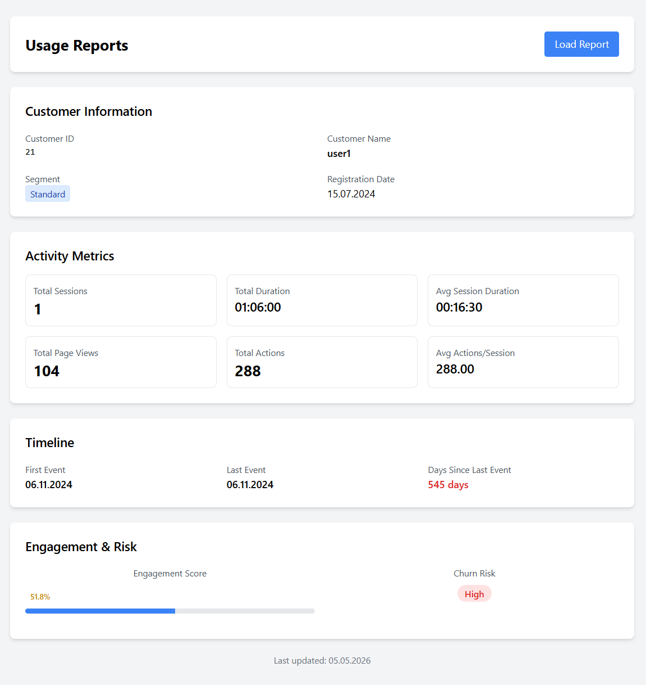

## Запуск проекта

### Этап 0

Создать общую сеть для взаимодействия двух compose
>docker network create shared_network

### Этап 1
>cd .../architecture-bionicpro/airflow

>docker-compose up -d

В этом compose содержится инфраструктура Apache Airflow и OLAP-база Clickhouse. Необходимо перейти в UI Airflow http://localhost:8081/home и запустить DAG crm_telemetry_etl. 
Проверить создание витрины можно с помощью команды

>docker-compose exec clickhouse clickhouse-client --query "SELECT * FROM customer_telemetry_mart"

### Этап 2

>cd .../architecture-bionicpro

>docker-compose up -d

В этом compose содержится Keycloak, frontend и backend. Необходимо перейти во frontend и нажать Load Report.

